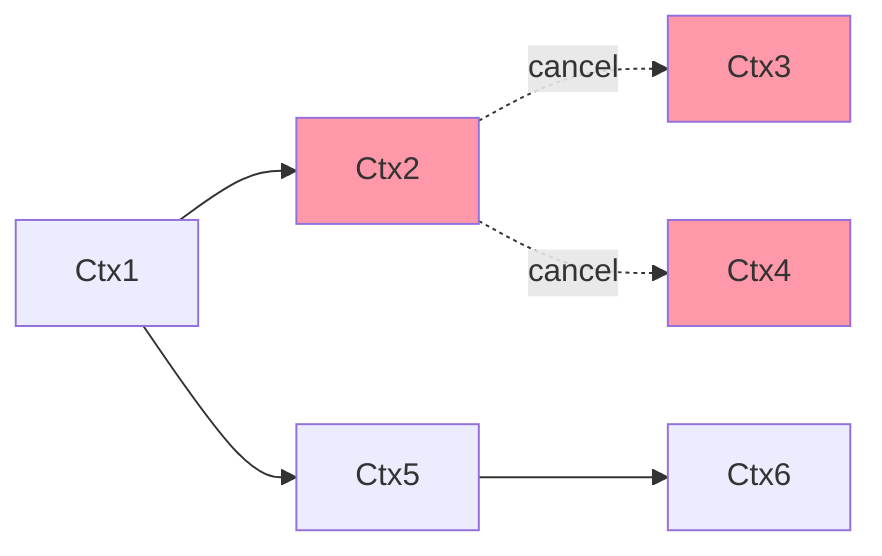

## 协程如何退出

一般来说，我们执行协程，需要等到协程执行完毕，才能够退出。但是，当我们想要让协程提前退出，就需要一种机制，去控制协程的退出。

以下例子使用`select + channel`的方式，控制协程的退出

```go

func main() {
	ch := make(chan bool)
	var wg sync.WaitGroup
	go func() {
		defer wg.Done()
        // 开启looper协程
		looper(ch)
	}()
	wg.Add(1)
    // 5秒后发送中断信号
	time.Sleep(time.Second * 5)
	fmt.Println("Signal to goroutine exit...")
	ch <- true
	fmt.Println("Signal sent.")
	wg.Wait()  // 等待协程完全退出
	fmt.Println("Exit.")
}

func looper(ch <-chan bool){
	for {
		select {
		case <-ch:
			fmt.Println("go break signal")
			return
		default:
			fmt.Println("looper is running...")
			time.Sleep(time.Second * 1)
		}
	}
}

```

上述例子通过一个`ch` channel 发送信号，让协程收到信号后终止循环。


## 使用Context控制协程退出

上述，我们可以通过select+ channel 的方式进行控制协程的退出，但是那是单个协程的退出，当我们想要控制多个协程的退出时，也可以用定义多个channel的方法，但是这会让代码变得十分复杂。

而Context，可以让我们跟踪到每个协程，从而更好地进行限制和控制。

使用 Context 改造上述的代码：
```go
func main() {
	var wg sync.WaitGroup
	ctx, stop := context.WithCancel(context.Background())
	go func() {
		defer wg.Done()
		looper(ctx)
	}()
	wg.Add(1)
	time.Sleep(time.Second * 5)
	fmt.Println("Signal to goroutine exit...")
	stop()	// 向context发送停止指令
	fmt.Println("Signal sent.")
	wg.Wait()
	fmt.Println("Exit.")
}

func looper(ctx context.Context){
	for {
		select {
		case <-ctx.Done():
			fmt.Println("go break signal")
			return
		default:
			fmt.Println("looper is running...")
			time.Sleep(time.Second * 1)
		}
	}
}

```

上述代码实现的功能和使用`select + channel`也是一样的，主要改动为：
- looper的ch参数改为了ctx context.Context
- 使用 `case <- ctx.Done()` 来判断是否接受到终止信号
- 使用 `context.WithCancel(context.Backgroud())`来生成一个可以取消的Context，返回两个内容： `context`和 `stop`函数，stop函数用于向context发送**终止指令**。`context.Backgroud()`用于生成一个**空的Context， 一般作为整个Context树的根节点**
- 原来的发送停止指令为向`ch`channel发送true，作为一个停止的指令，而现在通过调用 `stop()`来向ctx发送终止信号。

## 什么是Context

Context是一个接口，是并发安全的，具备**手动、定时、超时发出取消信号、传值**等功能，主要**用于控制多个协程之间的协作，尤其是取消操作**。一旦取消指令下达，那么被Context跟踪的这些协程都会收到取消信号，就**可以做清理和退出操作**

### Context的代码定义：
```go
type Context interface {
    Deadline() (deadline time.Time, ok bool)
    Done() <-chan struct{}
    Err() error
    Value(key interface{}) interface{}
}
```

1. `Deadline`方法可以获取设置的截止时间，第一个返回的值deadline是截止时间，到了这个时间，Context就会自动发起取消请求，第二个返回值`ok`表示这个Context是否设置了截止时间。
2. `Done`方法返回一个只读的channel，类型为struct{}。协程中，如果该方法返回的chan可以被读取，意味着Context已经发起了终止信号，我们的协程收到这个信号之后，就可以做协程的清理和退出操作了
3. `Err`方法返回**取消的错误原因**，是什么原因导致Contxt被取消。
4. `Value`方法可以获取该Context上绑定的值，是一个键值对，需要通过`key`来获取

最常用的是`Done`方法，我们用它来判断当前context是否被取消。

## Context树

我们不需要自己实现Context接口，因为Golang提供了多个函数帮助我们生成不同的Context，通过这些函数，我们可以生成一颗Context树，将不同的Context关联起来，这样，当父Context发出取消信号的时候，子Context也会发出该信号，以便控制不同层级的协程退出。

功能上分，有**四种**实现好的Context：

1. **空Context**：`context.Backgroud()`，不可取消，没有截止时间，主要用于Context的根节点
2. **可取消的Context**：`context.WithCancel(parent context.Context)`，用于发送取消信号，当取消时，子Context也会取消
3. **可以定时取消的Context**：
   - `context.WithDeadline(parant context.Context, d time.Time)`， 设置deadline，在某个时间取消
   - `context.WithTimeout(parant context.Context, timeout time.Duration)`， 设置多长时间后自动取消

4. **值Context**：`context.WithValue(parant context.Context, key, val interface{})`，用于存储key-value键值对

上述前三种都是可取消的Context，值Context则用于存储key-value键值对

## 使用Context取消多个协程

以上述的`looper`循环例子为例，使用Context同时取消多个协程

```go

func main() {
	var wg sync.WaitGroup
	wg.Add(4)
	ctx, stop := context.WithCancel(context.Background())
	for i := 0;i < 3; i++ {
        // 启动3个协程，使用父进程ctx控制这些进程的取消
		go func(id int) {
			defer wg.Done()
			looper(ctx, id)
		}(i)
	}
	// 创建一个子Context，当父Context取消时，subCtx也会发出取消信号
	subCtx, _ := context.WithCancel(ctx)
	go func() {
		defer wg.Done()
		looper(subCtx, 3)
		fmt.Println("looper 3 exist because parent context exit.")
	}()

	time.Sleep(time.Second * 5)
	fmt.Println("Signal to goroutine exit...")
	stop()	// 向context发送停止指令
	fmt.Println("Signal sent.")
	wg.Wait()
	fmt.Println("Exit.")
}

func looper(ctx context.Context, id int){
	for {
		select {
		case <-ctx.Done():
			fmt.Printf("looper %d: go break signal\n", id)
			return
		default:
			fmt.Printf("looper %d is running...\n", id)
			time.Sleep(time.Second * 1)
		}
	}
}

```

Context 之间的取消关系图：



可以看到，当节点Ctx2取消时，子节点Ctx4、Ctx5也一同被取消了。如果Ctx4、Ctx5还有更多的子节点的话，也会一并取消。

## Context传值

我们改造上述代码：

```go
func main() {
	var wg sync.WaitGroup
	wg.Add(1)
    // 创建一个可取消的parent Context
	ctx, stop := context.WithCancel(context.Background())
    // 创建一个ValueContext，key为userId, value为1
	valCtx := context.WithValue(ctx, "userId", 1)
	go func() {
		defer wg.Done()
		getUser(valCtx)
	}()
	time.Sleep(time.Second * 2)
	fmt.Println("Signal to goroutine exit...")
	stop()	// 向context发送停止指令
	fmt.Println("Signal sent.")
	wg.Wait()
	fmt.Println("Exit.")
}

func getUser(ctx context.Context){
	for {
		select {
		case <-ctx.Done():
			fmt.Printf("gorouting [getUser]: go break signal\n")
			return
		default:
			value := ctx.Value("userId")
			fmt.Printf("gorouting [getUser], userId=%v\n", value)
			time.Sleep(time.Second * 1)
		}
	}
}
```

可以看到，我们通过`context.WithValue`创建一个含值的Context，然后到goroutine中，在goroutine中通过`ctx.Value("userId")`将我们传入的值获取出来。

需要注意的是，`context.WithValue`是没有返回`cancelFunc`的，也就是说，我们不能够通过值Context主动告诉协程去终止，而是需要创建一个可取消的父Context，通过这个父Context发送取消信号。

## Context使用原则

1. Context不要放在结构体中，要以参数的方式传递
2. Context作为函数参数的时候，要作为第一个参数
3. 要使用`context.Backgroud()`函数生成根节点Context，也就是顶层Context
4. Context传值要传递必须传递的值，而且要尽可能少，不要什么都传
5. Context多协程安全，可以在多个协程中放心使用

## 总结：

> Context 通过 With 系列函数生成 Context 树，把相关的 Context 关联起来，这样就可以统一进行控制。一声令下，关联的 Context 都会发出取消信号，使用这些 Context 的协程就可以收到取消信号，然后清理退出。我们在定义函数的时候，如果想让外部给函数发取消信号，就可以为这个函数增加一个 Context 参数，让外部的调用者可以通过 Context 进行控制，比如下载一个文件超时退出的需求。


