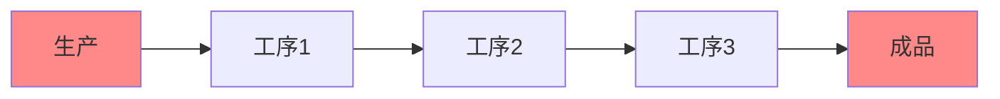
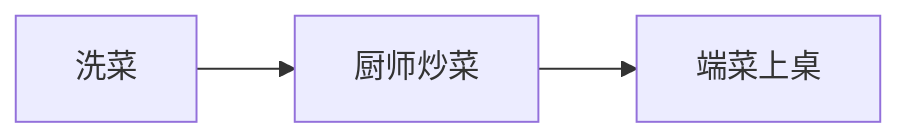
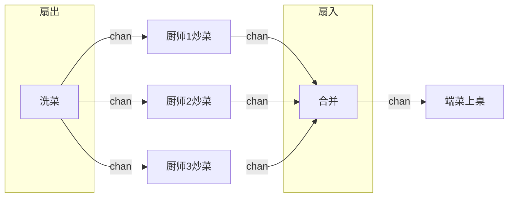

## for select 模式

这是一种常见的并发模式，我们一般使用 `for {} ` 死循环，然后里面加`select`配合`channel`，获取协程的终止信号，来控制协程的退出

```go
for {
    select {
    case <- done:
        // received stop signal, stopping.
        return
    default:
	    // processing ... 
    }
}
```

类似的还有 `for range select`模式，主要就是使用 `for ... range` 遍历某个数据数组，将数据发送到channel里面：

```go
for _, value := range []int{} {
    select {
    case <- done:
        // 接受到终止信号
        return
    case resultCh <- value:
        // do nothing but put value to rsult channel
    }
}
```

## select timeout 模式

select timeout模式，核心在于使用 `time.After(t time.Duration)` 返回一个定时的channel，使用select配合这个channel控制协程的退出。

来看一个网络访问超时的demo：

```go
func main(){
    result := make(chan string)
    go func(){
        // simulate internet visiting...
        time.Sleep(5 * time.Second)
        result <- "Done, internet visited."
    }()
    select {
        case v := <-result:
    	    fmt.Println("result from internet: ", v)
        case <- time.After(3 * time.Second):
	        fmt.Println("Timeout!")
    }
}
```

## pipeline 模式

pipeline流水线模式，顾名思义，就是整一个生产流程中有多个工序，后面的工序依赖前面一道工序的结果。

或者说，前面工序的输出，就是后面工序的输入。



我们以酒席的上菜流程来看，我们将其作为一个流水线，简化为3个步骤：

1. 洗菜
2. 炒菜
3. 端菜上桌

**洗菜**:

```go
// n表示需要处理的菜品数量
// 返回一个channel，用户传递洗好的菜
func wash(n int) <-chan string {
    washedCh := make(chan string)
    go func(){
    	defer close(washedCh)
    	for i := 1; i <= n; i++ {
    		washedCh <- fmt.Sprintf("洗好的菜%d", i)
		}
	}()
    return washedCh
}
```

**炒菜**：

```go
// 炒菜，传入channel，里面是洗好的菜
// 返回一个channel，里面是炒好的菜
func fire(washed <-chan string) <-chan string {
	firedCh := make(chan string)
	go func() {
		defer close(firedCh)
		for w := range washed {
			firedCh <- fmt.Sprintf("炒好的【%s】", w)
		}
	}()
	return firedCh
}
```

**上菜**：

```go
// 传菜，传入channel，里面是炒好的菜，我们负责将菜端到各桌
func deliver(fired <-chan string) {
	for food := range fired {
		fmt.Printf("已上桌： %s\n", food)
	}
}
```

**完整的酒席流程**：

三个工序（步骤）我们已经定义好了，接下来将其组装成为一个完整的流程：

```go
func main() {
	washed := wash(10)
	fired := fire(washed)
	deliver(fired)
}
```

流程输出记录如下： 

```
已上桌： 炒好的【洗好的菜1】
已上桌： 炒好的【洗好的菜2】
已上桌： 炒好的【洗好的菜3】
已上桌： 炒好的【洗好的菜4】
已上桌： 炒好的【洗好的菜5】
已上桌： 炒好的【洗好的菜6】
已上桌： 炒好的【洗好的菜7】
已上桌： 炒好的【洗好的菜8】
已上桌： 炒好的【洗好的菜9】
已上桌： 炒好的【洗好的菜10】
```

## 扇出扇入模式

原来的模式是这样的：



每道步骤都只有一个人，但是，洗菜是比较快的（假设不是很麻烦的菜，随便洗洗那种），炒菜却需要较长的时间，厨师需要配菜、掌控火候、调味装盘等。

所以，上述流程的性能瓶颈便是**炒菜**

在厨师炒菜的过程中，服务员需要等待菜炒好了才能端菜，这段时间便会空闲下来，没有充足的利用到资源，造成了浪费。

我们使用**扇出扇入模式**对上述流程进行改造：



主要改造内容就是：调用多个厨师来炒菜，然后将炒好的菜汇合在一起，服务员进行端菜。

首先，我们对炒菜函数进行改造，主要是加入一个参数`cooker`，用于区分当前菜品是哪个厨师炒的：

```go
// 炒菜，传入channel，里面是洗好的菜, cooker 表示厨师的名字
// 返回一个channel，里面是炒好的菜
func fire(washed <-chan string, cooker string) <-chan string {
	firedCh := make(chan string)
	go func() {
		defer close(firedCh)
		for w := range washed {
			firedCh <- fmt.Sprintf("%s炒好的【%s】", cooker, w)
		}
	}()
	return firedCh
}
```

然后实现菜品汇合部分的代码：

```go
// 将炒好的菜汇合在一起，提供给服务员端菜
func merge(fireds ...<-chan string) <-chan string {
    // 所有的菜品都将汇合到 merged channel 里面
	merged := make(chan string)
	var wg sync.WaitGroup
	go func() {
		wg.Add(len(fireds))
		defer close(merged)
		for _, fired := range fireds {
			go func(foods <-chan string) {
				defer wg.Done()
				for food := range foods {
					merged <- food
				}
			}(fired)
		}
		wg.Wait()
	}()
	return merged
}
```

最后！我们改造下main函数，让多个厨师炒菜，然后实现 菜品汇合 -> 端菜

```go
func main() {
	washed := wash(10)
    // 3个厨师炒菜
	fired1 := fire(washed, "cooker1")
	fired2 := fire(washed, "cooker2")
	fired3 := fire(washed, "cooker3")
    // 汇合菜品
	merged := merge(fired1, fired2, fired3)
    // 端菜
	deliver(merged)
}
```

流程输出记录：

```
已上桌： cooker3炒好的【洗好的菜3】
已上桌： cooker3炒好的【洗好的菜4】
已上桌： cooker1炒好的【洗好的菜1】
已上桌： cooker1炒好的【洗好的菜7】
已上桌： cooker3炒好的【洗好的菜5】
已上桌： cooker1炒好的【洗好的菜8】
已上桌： cooker3炒好的【洗好的菜10】
已上桌： cooker1炒好的【洗好的菜9】
已上桌： cooker2炒好的【洗好的菜2】
已上桌： cooker2炒好的【洗好的菜6】
```

可以看到，各个菜品的上菜时间是无序的，也就是说，哪道菜先做好就先上，大大提高了上菜效率，不会让客人久等了！

## Futures 模式

流水线 Pipeline模式中的各个步骤都是相互依赖的，只有上一个工序完成，下一个工序才能开始。

**Futures模式**：实际需求中，很多任务是独立的，比如说煲汤、煮饭和炒菜，我们可以同时煲汤、煮饭，不需要立刻获取到煮好的汤和饭，可以先去做其他的事情，比如炒菜，然后在未来的某个时候，去获取煲汤和煮饭的结果，这就是未来模式（Futrues模式）

以上述的煲汤、煮饭、炒菜为例，代码实现一下：

```go
func main() {
	fmt.Println("开始做饭")
	riceCh := rice()
	soupCh := soup()
	fmt.Println("去做其他事情。。。")
	fmt.Println("开始炒菜吧。。。")
	time.Sleep(2 * time.Second)
	fmt.Println("菜炒好了！")
	r := <-riceCh
	s := <-soupCh
	fmt.Printf("吃饭！ 菜、%s、喝 %s\n", r, s)
}

// 煮饭
func rice() <-chan string {
	fmt.Println("开始煮饭啦")
	ch := make(chan string)
	go func() {
		time.Sleep(3 * time.Second)		// 煮饭耗时
		ch <- "煮好的饭"
		fmt.Println("饭煮好了！")
	}()
	return ch
}
// 煲汤
func soup() <-chan string {
	fmt.Println("开始煲汤啦！")
	ch := make(chan string)
	go func() {
		time.Sleep(4 * time.Second)		// 煲汤耗时
		ch <- "煲好的汤"
		fmt.Println("汤煲好了")
	}()
	return ch
}
```

Futures 模式下的协程和普通协程最大的区别是**可以返回结果**，而这个结果会在未来的某个时间点使用。所以**在未来获取这个结果的操作必须是一个阻塞的操作**，要一直等到获取结果为止。

**如果大任务可以拆解为一个个独立并发执行的小任务，并且可以通过这些小任务的结果得出最终大任务的结果，就可以使用 Futures 模式**

## 最后

并发模式和设计模式很相似，都是对现实场景的抽象封装，以便提供一个统一的解决方案。但和设计模式不同的是，并发模式更专注于异步和并发。

