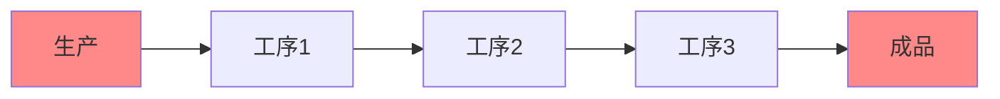
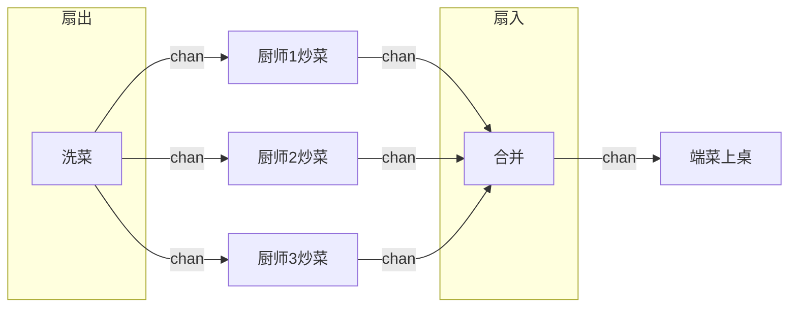

## for select 模式

这是一种常见的并发模式，我们一般使用 `for {} ` 死循环，然后里面加`select`配合`channel`，获取协程的终止信号，来控制协程的退出

```go
for {
    select {
    case <- done:
        // received stop signal, stopping.
        return
    default:
	    // processing ... 
    }
}
```

类似的还有 `for range select`模式，主要就是使用 `for ... range` 遍历某个数据数组，将数据发送到channel里面：

```go
for _, value := range []int{} {
    select {
    case <- done:
        // 接受到终止信号
        return
    case resultCh <- value:
        // do nothing but put value to rsult channel
    }
}
```

## select timeout 模式

select timeout模式，核心在于使用 `time.After(t time.Duration)` 返回一个定时的channel，使用select配合这个channel控制协程的退出。

来看一个网络访问超时的demo：

```go
func main(){
    result := make(chan string)
    go func(){
        // simulate internet visiting...
        time.Sleep(5 * time.Second)
        result <- "Done, internet visited."
    }()
    select {
        case v := <-result:
    	    fmt.Println("result from internet: ", v)
        case <- time.After(3 * time.Second):
	        fmt.Println("Timeout!")
    }
}
```

## pipeline 模式

pipeline流水线模式，顾名思义，就是整一个生产流程中有多个工序，后面的工序依赖前面一道工序的结果。

或者说，前面工序的输出，就是后面工序的输入。



我们以酒席的上菜流程来看，我们将其作为一个流水线，简化为3个步骤：

1. 洗菜
2. 炒菜
3. 端菜上桌

**洗菜**:

```go
// n表示需要处理的菜品数量
// 返回一个channel，用户传递洗好的菜
func wash(n int) <-chan string {
    washedCh := make(chan string)
    go func(){
    	defer close(washedCh)
    	for i := 1; i <= n; i++ {
    		washedCh <- fmt.Sprintf("洗好的菜%d", i)
		}
	}()
    return washedCh
}
```

**炒菜**：

```go
// 炒菜，传入channel，里面是洗好的菜
// 返回一个channel，里面是炒好的菜
func fire(washed <-chan string) <-chan string {
	firedCh := make(chan string)
	go func() {
		defer close(firedCh)
		for w := range washed {
			firedCh <- fmt.Sprintf("炒好的【%s】", w)
		}
	}()
	return firedCh
}
```

**上菜**：

```go
// 传菜，传入channel，里面是炒好的菜，我们负责将菜端到各桌
func deliver(fired <-chan string) {
	for food := range fired {
		fmt.Printf("已上桌： %s\n", food)
	}
}
```

**完整的酒席流程**：

三个工序（步骤）我们已经定义好了，接下来将其组装成为一个完整的流程：

```go
func main() {
	washed := wash(10)
	fired := fire(washed)
	deliver(fired)
}
```

流程输出记录如下： 

> 已上桌： 炒好的【洗好的菜1】
> 已上桌： 炒好的【洗好的菜2】
> 已上桌： 炒好的【洗好的菜3】
> 已上桌： 炒好的【洗好的菜4】
> 已上桌： 炒好的【洗好的菜5】
> 已上桌： 炒好的【洗好的菜6】
> 已上桌： 炒好的【洗好的菜7】
> 已上桌： 炒好的【洗好的菜8】
> 已上桌： 炒好的【洗好的菜9】
> 已上桌： 炒好的【洗好的菜10】


## 扇出扇入模式



