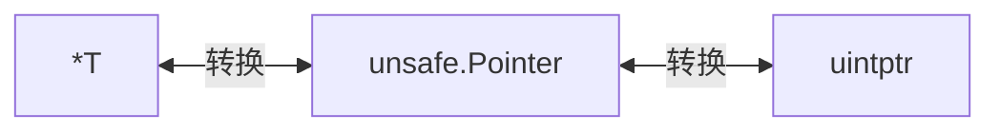

`unsafe`是不安全的，可以绕过go的安全检查机制，直接对内存进行读写，非必要不使用。

## 指针类型转换

go是一门**强类型的静态语言**，意味着一旦定义了，类型就不能改变，且类型检查在运行前已经完成。

出于安全考虑，go不允许两个指针类型进行转换，比如 `*int` 不能转换成 `*float`。

```go
i := 10
ip := &i
var fp *float64 = (*float64)(ip)	// 尝试将 *int 转换成 *float64
```

在编译的时候，会报错： `cannot convert ip (type * int) to type * float64`，提示不可转换

### unsafe.Pointer

`unsafe.Pointer`表示**任意类型的指针**，上述例子中，我们使用 `unsafe.Pointer`进行中转，实现指针类型转换

```go
i := 10
ip := &i
var fp *float64 = (*float64)(unsafe.Pointer(ip))	// 尝试将 *int 转换成 *float64
*fp = *fp * 3
fmt.Println(i,*fp, ip, fp)
```

输出：

```
30 1.5e-322 0xc0000aa058 0xc0000aa058
```

可以看到，通过转化后的指针修改指向内存的值，原始值**i**也变成了30，ip和fp指向的是同一块内存地址。需要注意的是，试图通过 `*fp` 打印出原来内存的数据时，却出现了一个**异常值**，说明**指针可以通过 `unsafe.Pointer` 进行转化，但转化后的指针不一定可以访问到原始内存的值**。

`unsafe.Pointer`源码定义：

```go
// ArbitraryType is here for the purposes of documentation
// only and is not actually part of the unsafe package. 
// It represents the type of an arbitrary Go expression.
type ArbitraryType int
type Pointer *ArbitraryType
```

`ArbitraryType`可以表示任意类型，在源码中只是文档需要。`unsafe.Pointer`是 `*ArbitraryType`，表示**通用型指针**，可以表示任何内存地址。

### uintptr 指针类型

因为 `unsafe.Pointer` 不能进行运行，如 `+` 运行操作，因此有 `uintptr`，它足够大，可以表示任何指针，也可以对指针进行偏移计算，访问特定的内存，实现真正的内存级操作。

`uintptr`定义：

```go
// uintptr is an integer type that is large enough 
// to hold the bit pattern of any pointer.
type uintptr uintptr
```

使用 `uintptr`修改结构体内部字段例子：

```go
func main() {
	p := new(person)
    // p.Name是第一个字段，因此不需要偏移
	pName := (*string)(unsafe.Pointer(p))
	*pName = "Mike"
    // p.Age不是第一个字段，需要使用 uintptr 和 unsafe.Offsetof 进行偏移计算
	u := uintptr(unsafe.Pointer(p)) + unsafe.Offsetof(p.Age)
   	// 计算过偏移的 uintptr 需要通过 unsafe.Pointer 再次转化成 *int（或者*uint）
	pAge := (*int)(unsafe.Pointer(u))
	fmt.Println("address of uintptr of age is : ", u, pAge, &p.Age)
	*pAge = 20
	fmt.Println(*p)
}
```

输出：

```
address of uintptr of age is :  824633737352 0xc000004088 0xc000004088
{Mike 20}
```

可以看到，计算偏移后， `PAge` 和 `p.Age` 指向的地址是一样的，对应的值也修改成功了。

上述操作步骤：

> 1. 先使用 new 函数声明一个 *person 类型的指针变量 p。
> 2. 然后把 *person 类型的指针变量 p 通过 unsafe.Pointer，转换为 *string 类型的指针变量 pName。
> 3. 因为 person 这个结构体的第一个字段就是 string 类型的 Name，所以 pName 这个指针就指向 Name 字段（偏移为 0），对 pName 进行修改其实就是修改字段 Name 的值。
> 4. 因为 Age 字段不是 person 的第一个字段，要修改它必须要进行指针偏移运算。所以需要先把指针变量 p 通过 unsafe.Pointer 转换为 uintptr，这样才能进行地址运算。既然要进行指针偏移，那么要偏移多少呢？这个偏移量可以通过函数 unsafe.Offsetof 计算出来，该函数返回的是一个 uintptr 类型的偏移量，有了这个偏移量就可以通过 + 号运算符获得正确的 Age 字段的内存地址了，也就是通过 unsafe.Pointer 转换后的 *int 类型的指针变量 pAge。
> 5. 然后需要注意的是，如果要进行指针运算，要先通过 unsafe.Pointer 转换为 uintptr 类型的指针。指针运算完毕后，还要通过 unsafe.Pointer 转换为真实的指针类型（比如示例中的 *int 类型），这样可以对这块内存进行赋值或取值操作。
> 6. 有了指向字段 Age 的指针变量 pAge，就可以对其进行赋值操作，修改字段 Age 的值了。

上述代码效果等价于：

```go
func main() {
    p := new(person)
    p.Name = "Mike"
    p.Age = 20
}
```

### 指针转换规则



`unsafe.Pointer`主要用于指针类型的转换，`uintptr`主要用于偏移量定位不同的内存位置。

## 总结

unsafe包里的功能虽然不安全，但很实用，如指针运算、类型转换等，有助于我们提高性能。