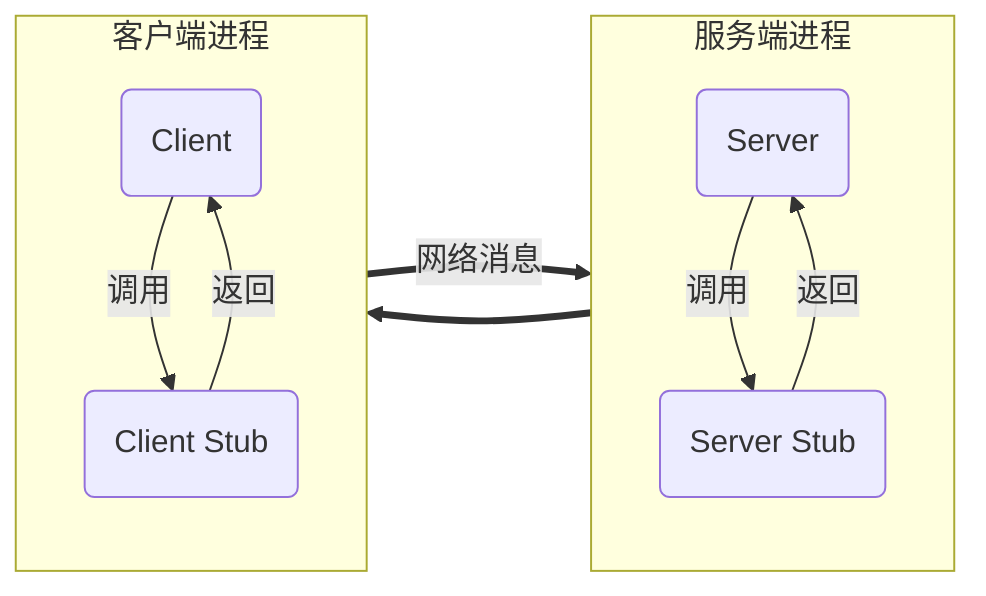

## RPC

RPC  - Remote Procedure Call  称为远程过程调用，是分布式系统中，不同节点调用的方式（进程间通信），属于 C/S 模式。由客户端发起，调用服务端的方法进行通信，服务端将结果返回给客户端。

RPC的两个核心：

- 通信协议
- 序列化

**序列化**和**反序列化**是一种把传输内容编码和解码的方式，常见的编解码方式有 JSON、Protobuf 等。

大多数 RPC 架构中，都有 **Client、Client Stub、Server、Server Stub**这四个组件，Client 和 Server 通过 **Socket** 进行通信。



调用流程：

- client 调用 client stub，同时把参数传给 client stub
- client stub将参数打包编码，然后通过系统调用发送到服务端进程
- 客户端本地系统发送信息到服务器
- 服务器系统将信息发送到 server stub
- server stub 将信息解码
- server stub 调用真正的服务端程序 server
- server 处理后，通过同样的方式，将结果返回到 client

## go 实现简单的RPC服务

go内置了 `net/rpc` 包帮助我们实现rpc服务。

接下来实现一个简单的 `Greet` rpc 服务：

### 定义服务

rpc/server/greet_service.go

```go
package server

type GreetService struct {}

type GreetServiceArgs struct {
	Name string
}

func (g *GreetService) Greet(args GreetServiceArgs, reply *string) error {
	log.Printf("Greeting to [%s]", args.Name)
	s := fmt.Sprintf("Hello, %s, you are using go rpc, have a good day!", args.Name)
	*reply = s
	return nil
}
```

上述代码做了以下几件事：

- 定义 `GreetService`，表示远程服务对象
- `GreetServiceArgs`表示参数，里面有个 `Name`成员
- `Greet`方法实现了向服务调用者打招呼的功能

### 注册服务

直接通过 `RegisterName` 方法注册

rpc/server_main.go

```go
package main

import (
	"let_go/rpc/server"
	"log"
	"net"
	"net/rpc"
)

func main() {
	if err := rpc.RegisterName("GreetService", new(server.GreetService)); err != nil {
		log.Fatalf("Register rpc service error: %s", err)
	}
	l, e := net.Listen("tcp", ":1234")
	if e != nil {
		log.Fatalf("Server error: %s", e)
	}
	rpc.Accept(l)
}
```

- 直接通过 rpc.RegisterName 注册了一个服务对象 GreetService
- 通过 net.Listen 建立一个TCP连接，监听 1234 端口
- 然后通过 rcp.Accept函数，在该tcp连接的基础上提供rcp服务

### 规则

想要把一个对象注册为RPC服务，可以让客户端远程访问，则该**对象的方法**需要满足以下条件：

- 方法的类型是可导出的（公开的）
- 方法本身也是可以导出的
- 方法必须有两个参数，且参数类型是可导出或者内建的
- 方法必须返回一个 error 类型

该方法的格式：

```go
func (t *T) MethodName(argType T1, replyType *T2) error
```

这里的 T1、T2 都是可以被 `encoding/gob`序列化的

- 第一个参数 `argType` 是调用者（客户端）提供的
- 第二个参数 `replyType` 是返回给调用者结果，必须是指针类型

### 客户端调用

rpc/client_main.go

```go
package main

import (
	"let_go/rpc/server"
	"log"
	"net/rpc"
)

func main(){
	client, err := rpc.Dial("tcp", "localhost:1234")
	if err != nil {
		log.Fatalf("RPC dial error: %s", err)
	}
	args := server.GreetServiceArgs{Name: "Mike"}
	var reply string
	err = client.Call("GreetService.Greet", args, &reply)
	if err != nil {
		log.Fatalf("RPC call error: %s", err)
	}
	log.Printf("RPC reply: [%s]", reply)
}
```

- 通过 `rpc.Dial` 建立跟 rpc 服务端的连接，填写正确的IP和端口
- 构造参数 args 和返回值 reply
- 使用 `rpc.Call` 调用远程rpc方法，传入3个参数，第一个是服务的方法，新式为 `ServiceName.Method`，我们在前面注册了一个 `GreetService`，这个service有一个方法 `Greet`，因此我们通过客户端调用这个方法是 `GreetService.Greet`，后面两个参数分别为方法的参数值和返回值。
- 返回值必须是一个指针

运行服务端，然后运行客户端，输出结果如下：

服务端：

```
2022/03/30 14:43:17 Greeting to [Mike]
```

客户端：

```
2022/03/30 14:43:17 RPC reply: [Hello, Mike, you are using go rpc, have a good day!]
```

## 基于 HTTP 的RPC

go rpc 已经支持了http协议进行调用，我们可以简单对之前的代码进行修改：

rpc/server_main.go

```go
func main() {
	if err := rpc.RegisterName("GreetService", new(server.GreetService)); err != nil {
		log.Fatalf("Register rpc service error: %s", err)
	}
	rpc.HandleHTTP()	// 新增一行
	l, e := net.Listen("tcp", ":1234")
	if e != nil {
		log.Fatalf("Server error: %s", e)
	}
	//rpc.Accept(l)
	http.Serve(l, nil)	// 修改为 http 服务
}
```

客户端的调用更加简单，直接将 `rpc.Dail` 改为 `rpc.DailHTTP` 即可

rpc/client_main.go

```go
func main(){
	//client, err := rpc.Dial("tcp", "localhost:1234")
	client, err := rpc.DialHTTP("tcp", "localhost:1234")
    // ...
}
```

 重新运行代码，输出结果是一样的。

使用基于http的rpc之后，我们可以在浏览器中输入连接 `http://localhost:1234/debug/rpc` 即可查看我们定义的rpc服务

返回**注册的RPC服务、方法签名、被调用次数**等信息

## JSON RPC跨平台通信

上述实现的rpc是通过 `encoding/gob` 方法编解码的，而在跨平台调用的时候，其他语言对其进行解码会比较困难。

### 基于TCP的 JSON RPC 

选择**通用的编码**是实现跨语言RPC服务的核心，比如JSON编码，go语言为我们提供了支持json的rpc包：`net/rpc/jsonrpc`

对前面的服务端代码进行改造：

rpc/server_main.go

```go
func main() {
	if err := rpc.RegisterName("GreetService", new(server.GreetService)); err != nil {
		log.Fatalf("Register rpc service error: %s", err)
	}
	l, e := net.Listen("tcp", ":1234")
	if e != nil {
		log.Fatalf("Server error: %s", e)
	}
	for {
		conn, err := l.Accept()
		if err != nil {
			log.Fatalf("Tcp accept error: %s", err)
			return
		}
		go jsonrpc.ServeConn(conn)
	}
}
```

只是简单的通过 `l.Accept` 获取当前连接，然后将连接交给 `jsonrpc.ServeConn` 进行处理

客户端调用：

```go
func main(){
    // rpc.Dial --> jsonrpc.Dial
	client, err := jsonrpc.Dial("tcp", "localhost:1234")	
	// ...
}
```

直接使用 `jsonrpc.Dial` 替换 `rpc.Dial`即可

### 基于HTTP的JSON RPC

服务端改造

rpc/server_main.go

```go

func main() {
	if err := rpc.RegisterName("GreetService", new(server.GreetService)); err != nil {
		log.Fatalf("Register rpc service error: %s", err)
	}
    // 实现核心，使用 http.HandleFunc 注册一个处理rpc的handler
	http.HandleFunc(rpc.DefaultRPCPath, func(rw http.ResponseWriter, r *http.Request){
		conn, _, err := rw.(http.Hijacker).Hijack()
		if err != nil {
			log.Printf("Error hijack from addr[%s], err: %s", r.RemoteAddr, err)
			return
		}
		fmt.Fprintf(conn, "HTTP/1.0 200 Connected to JSON RPC\n\n")
		jsonrpc.ServeConn(conn)
	})
	l, e := net.Listen("tcp", ":1234")
	if e != nil {
		log.Fatalf("Server error: %s", e)
	}
	http.Serve(l, nil)
}
```

服务器代码，通过 `http.HandleFunc`注册一个rpc的路径处理函数，然后通过 `http.Hijacker.Hijack()`劫持连接，再交给 `jsonrpc`处理，如同基于tcp的jsonrpc实现一般。

客户端代码调整

rpc/client_main.go

```go
func main(){
	client, err := DialHTTP("tcp", "localhost:1234")
	if err != nil {
		log.Fatalf("RPC dial error: %s", err)
	}
	args := server.GreetServiceArgs{Name: "Mike"}
	var reply string
	err = client.Call("GreetService.Greet", args, &reply)
	if err != nil {
		log.Fatalf("RPC call error: %s", err)
	}
	log.Printf("RPC reply: [%s]", reply)

}


func DialHTTP(network, address string) (*rpc.Client, error) {
	return DialHTTPPath(network, address, rpc.DefaultRPCPath)
}

// 从 rpc.DialHTTPPath 改造而来
func DialHTTPPath(network, address, path string) (*rpc.Client, error) {
	var err error
    // 建立TCP连接
	conn, err := net.Dial(network, address)
	if err != nil {
		return nil, err
	}
    // 写入请求头
	fmt.Fprintf(conn, "GET %s HTTP/1.0\n\n", path)
    // 读取http响应体
	resp, err := http.ReadResponse(bufio.NewReader(conn), &http.Request{Method: "GET"})
	if err == nil{
        // 如果服务端返回了 "200 Connected to JSON RPC" 说明连接成功
		if resp.Status == "200 Connected to JSON RPC" {
            // 直接从当前连接创建 jsonRpcClient 即可
			return jsonrpc.NewClient(conn), nil
		}
		return nil, errors.New("Http response error, status=" + resp.Status)
	}
	conn.Close()
	return nil, &net.OpError{
		Op: "dial-http",
		Net: network + " " + address,
		Addr: nil,
		Err: err,
	}
}
```

说是基于 http 的 rpc调用，实际上可以称作是披着http外皮原生jsonrpc调用，所用到http的地方，不过是请求了一个http地址，获取正确的连接，然后就是正常的jsonrpc调用的通信流程。

上述改动，通过修改 `rpc.DialHTTPPath`方法，请求服务端地址，获取一个rpc连接，然后实现jsonrpc通信。

#### 跨平台，使用python调用基于http的jsonrpc服务

只要符合[jsonrpc通信规范](https://www.jsonrpc.org/specification)，其他语言可以调用go的rpc服务，以python为例，调用上述*基于http的jsonrpc服务*，上代码：

test_go_jsonrpc.py

```python
import json, socket

# 建立tcp连接
s = socket.create_connection(("localhost", 1234))

# 发送http请求，成功后才能发起jsonrpc通信
req_body = '''GET /_goRPC_ HTTP/1.0\n\n'''
s.sendall(req_body.encode())
print((s.recv(4096)).decode())

# rpc调用参数，id用以区分返回内容，另外包含：
# method参数：需要调用的方法名称
# params参数：参数列表，服务端定义的是一个结构体，这里需要是一个可以让go unmarshal为对应的参数结构体的json对象
rpc_params = dict(
    id=2,
    method="GreetService.Greet",
    params=[{"Name": "python"}],
)
s.sendall(json.dumps(rpc_params).encode())
print((s.recv(4096)).decode())
```

运行上述python代码，可以看到返回：

```
>python test_go_jsonrpc.py
HTTP/1.0 200 Connected to JSON RPC


{"id":2,"result":"Hello, python, you are using go rpc, have a good day!","error":null}
```

首先是http请求，返回了正确的header： `HTTP/1.0 200 Connected to JSON RPC`，说明接下来可以进行jsonrpc通信了

然后是jsonrpc通信的返回结果，使用json解码后，得到一个json字符串，其中有三个字段：

- id： 我们发起请求参数里面的id
- result：rpc调用的返回结果
- error：调用rpc产生的错误