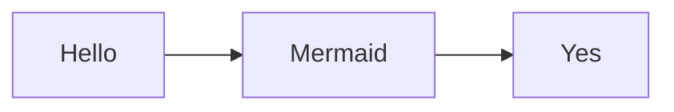

由于我的博客文章里面用到了mermaid绘制流程图，从Jekyll迁移到Hugo之后，使用的**PaperMod**主题是默认不支持mermaid渲染的，搜了很多帖子，看到有很多解决办法。

比如有定义 `/layouts/shortcodes/mermaid.html` 的，然后在代码里面，需要用到mermaid的地方（文章里面）这样写：

```markdown
{{ <mermaid> }}
... 这里写mermaid内容
{{ </mermaid> }}
```

但是这样的写法不是我想要的，我想要的是保留原来的写法，能够在渲染成html的时候，动态渲染 .language-mermaid 这个类的元素为 mermaid代码块。

查了一下PaperMod这个主题的代码，发现预留了 `extend_head.html` 这个扩展html头，太棒了！我们就可以在不改变原有主题代码的情况下，增添自己的`head`内容！

首先，我们新建一个文件： `layouts/partials/extend_head.html`，然后在里面写上mermaid的初始化代码：

```html
<!-- 使用cdn加载文件 -->
<script src="https://cdn.jsdelivr.net/npm/mermaid/dist/mermaid.min.js"></script>
<script>
// 自定义mermaid配置
const config = {
    startOnLoad:true,
    theme: 'forest',
    themeVariables: {
        lineColor: "#fafafa"    // 由于paperMod的代码块背景是黑色的，这里将线条设置为白色
    },
    flowchart: {
        useMaxWidth:false,
        htmlLabels:true
        }
};
mermaid.initialize(config);
// 需要注意的是，要将初始化代码放到 window.onload 回调函数里面才有用
// 否则会因为在html元素加载前进行初始化，找不到元素而失效
window.onload = () => {
    window.mermaid.init(undefined, document.querySelectorAll('.language-mermaid'));
}
</script>
```

Ok！现在，我的文章就可以支持使用mermaid画图了！


